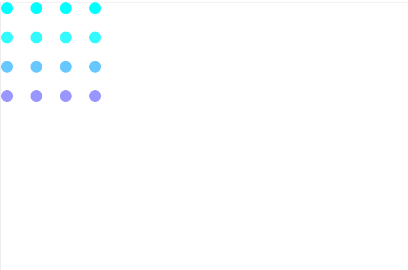
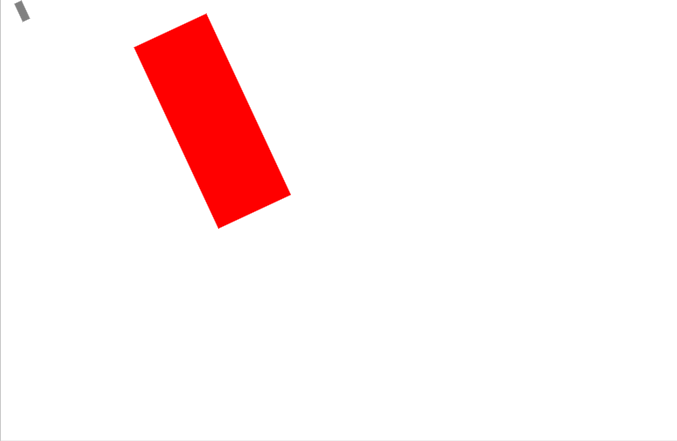
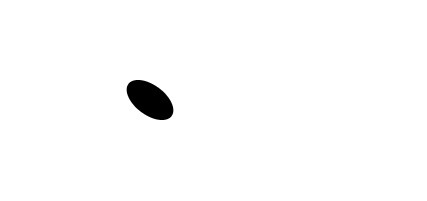
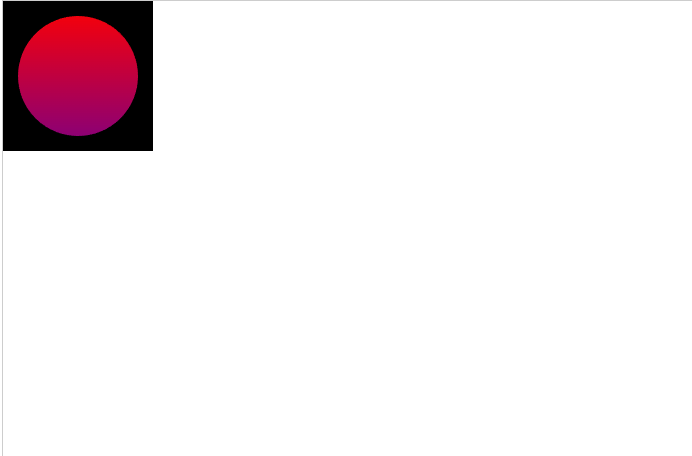
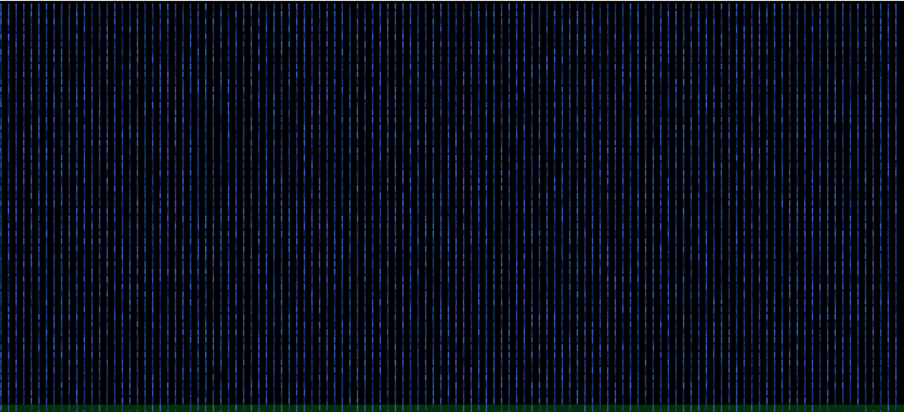
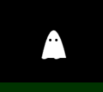
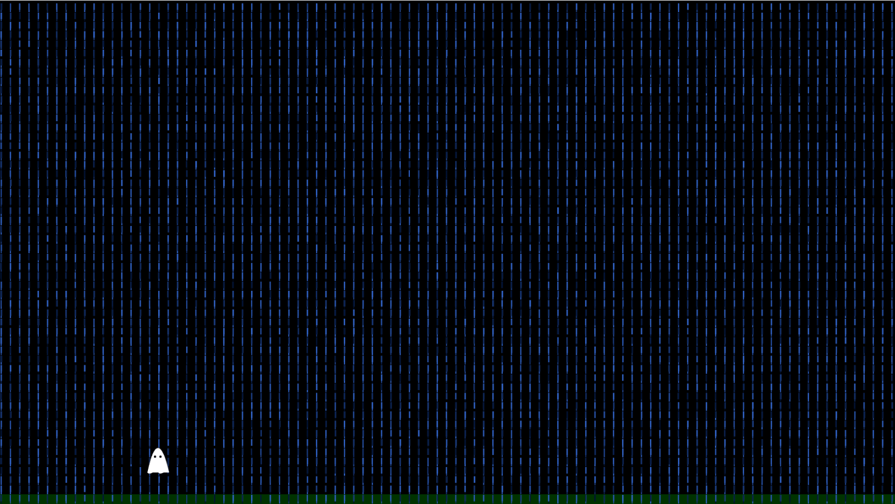

# canvasShowoff

## Autores
Gabriele Batista Sousa e Filipe Custodio Gonçalves

## Descrição 
Esse é um projeto solicitado em aula pela orientadora Aline Firmino, com o objetivo de pesquisar e aplicar os conceitos de Translação, Rotação, Escala, Transform, Clipping Path e Orientação a Objeto junto aos conceitos.

## Estrutura do projeto

* `index.html`-estrutura básica do site.

* `main.js`-arquivo JavaScript para adicionar os códigos do site.

* `classes`-classes do projeto

## Pesquisa sobre o projeto

__Translação__ 

O conceito de "`translate(x, y)`" , refere-se ao movimento de objetos ou elementos em um espaço bidimensional de uma posição para outra. A translação é uma operação de transformação que move um objeto de um local para outro, sem alterar sua
orientação ou forma.

```ruby
function draw() {
  const ctx = document.getElementById("canvas").getContext("2d");

 for (let i = 0; i < 4; i++) {
    for (let j = 0; j < 4; j++) {
      ctx.save();
      ctx.fillStyle = `rgb(${51 * i}, ${300 - 50 * i}, 300)`;
      ctx.translate(10 + j * 50, 10 + i * 50);
      ctx.beginPath();
      ctx.arc(0 , 0 , 10, 0, Math.PI * 2);
      ctx.fill()
      ctx.restore();
    }
  }
}

draw();
```

Resultado:



__Rotação__

O conceito de "`rotate()`"  é processo de girar um objeto, elemento ou gráfico em um espaço bidimensional, geralmente em torno de um ponto de referência. A rotação é uma transformação que altera a orientação de um objeto sem modificar sua forma
ou posição. 

```ruby
const canvas = document.getElementById("canvas");
const ctx = canvas.getContext("2d");

ctx.rotate((45 * Math.PI) / 180);
ctx.fillStyle = "gray";
ctx.fillRect(100, 0, 80, 20);
```

Resultado:



__Escala__

O conceito de "`scale(x, y)`" em JavaScript, refere-se ao processo de redimensionar um objeto, elemento ou gráfico em um espaço bidimensional. A escala é uma transformação que altera as dimensões de um objeto, aumentando ou diminuindo seu tamanho
em relação a um ponto de referência.

```ruby
const canvas = document.getElementById("canvas");
const ctx = canvas.getContext("2d");

ctx.rotate((-25 * Math.PI) / 180);
ctx.fillStyle = "gray";
ctx.fillRect(10, 10, 8, 20);

ctx.scale(10, 10);
ctx.fillStyle = "red";
ctx.fillRect(10, 10, 8, 20);

```

Resultado:


__Transform__

O método de transform permite realizar mudanças diretamente na matriz do caminho. A sintaxe é:
´transform(A, B, C, D, E, F)´;
onde:

__A__ é a escala horizontal

__B__ é a distorção horizontal

__C__ é a distorção vertical

__D__ é a escala vertical

__E__ e __F__ são o movimento horizontal e vertical respectivamente.

Para exemplificar, pense no canvas como uma tela de borracha. Os valores de A e D são o tamanho dessa tela, os valores de B e C é o quanto você estica as extremidades dessa tela horizontal e verticalmente e finalmente, os valores de E e F definem onde você posiciona essa tela onde E é o `eixo X` e F o `eixo Y`.

Exemplo de sintaxe:

```ruby
const canvas = document.getElementById("canvas");
const ctx = canvas.getContext("2d");

ctx.beginPath();
ctx.setTransform(1, 0, 0.5, 1, 0, 0);
ctx.fillstyle = "black";
ctx.arc(100, 100, 20, 0, 2 * Math.PI);
ctx.fill();
```

Resultado:



__Clipping path__

O clipping path funciona como uma janela para o canvas, mostrando apenas oque está dentro de seu desenho e escondendo oque fica de fora. A sintaxe usa a função `clip()`:

```ruby
ctx.beginPath();
ctx.arc(0, 0, 60, 0, Math.PI * 2, true);
ctx.clip();
```

Resultado:



O exemplo acima demonstra um círculo feito no canvas. O método “`clip()`” é utilizado no lugar do “`closePath()`”, isso torna esse caminho uma janela para os próximos desenhos do canvas.

## códigos do git
git config --global user.name "username do github"

git config --global user.email "email do 

github"

git init

git remote add origin "link do projeto"

git pull --allow-unrelated-histories "link do projeto"

git add .

git commit -am "nome do push que voce escolher"

git push origin main

## desenvolvimento do projeto

 1. O arquivo Index.html é a base do projeto. Ele abriga dois canvas separados, um para o fantasma e outro para o cenario. Em seguida ele chama pelos script principal e suas classes.
 
 2. As classes do projeto são duas. Uma para o cenario e outra para o fantama. A classe cenario tem como atributos sua posição de X e Y, seus metodos são o desenho de uma janela feita atravez de um clipping path e uma função que gera uma chuva constante feita por caracteres. A classe fantasma é a classe que se move pela tela. Tem um método que desenha o fantasma, outro para se mover (apagando e redesenhando o fantasma em uma nova posição) e um para que retorne ao chão quando pula. O fantasma também possui algumas deformações ativadas ao apertar "S" e rolar a roda do mouse
 
 3. O script principal define ambos os canvas com nomes distintos e define seus contextos em 2d. Seguindo, o script define alguns valores como a posição do fantasma e do chão e instancia as funções do fantasma, identificando bot~es apertados e acionando a função de acordo.




